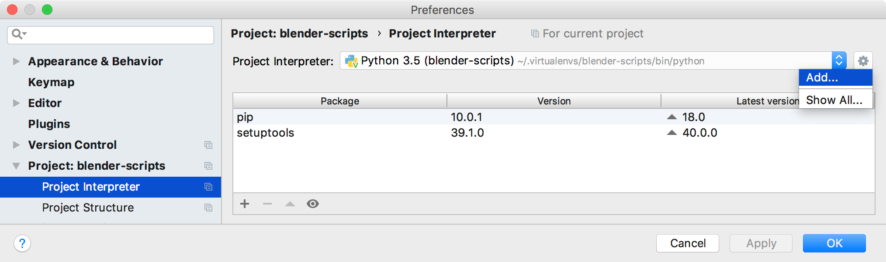
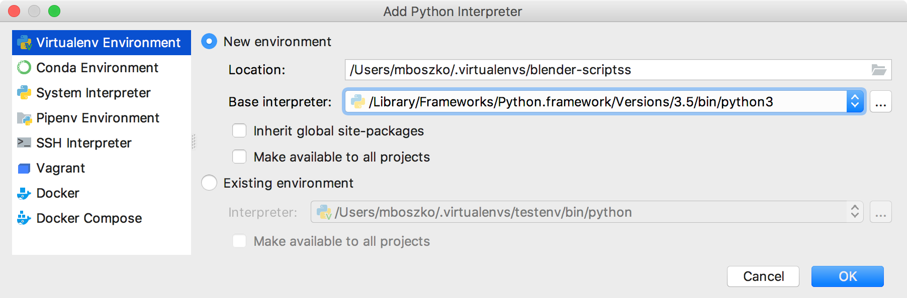
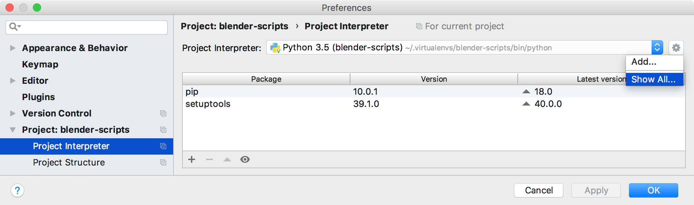
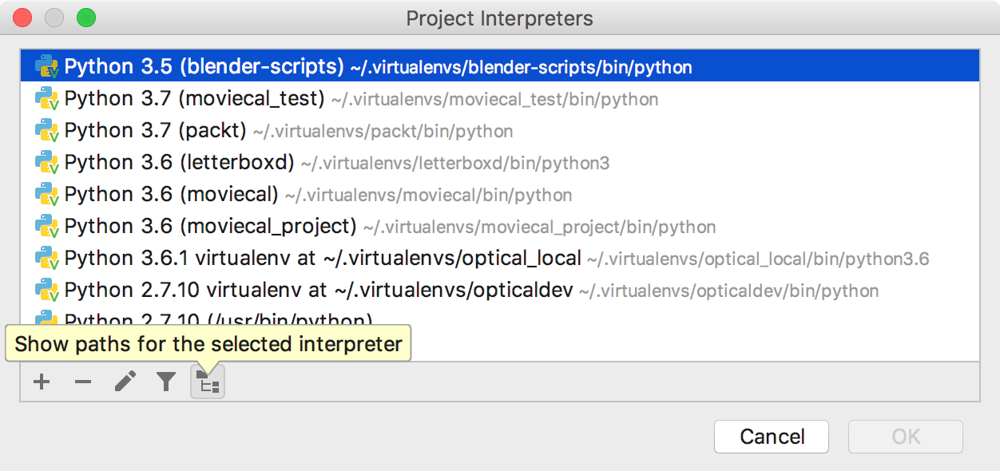
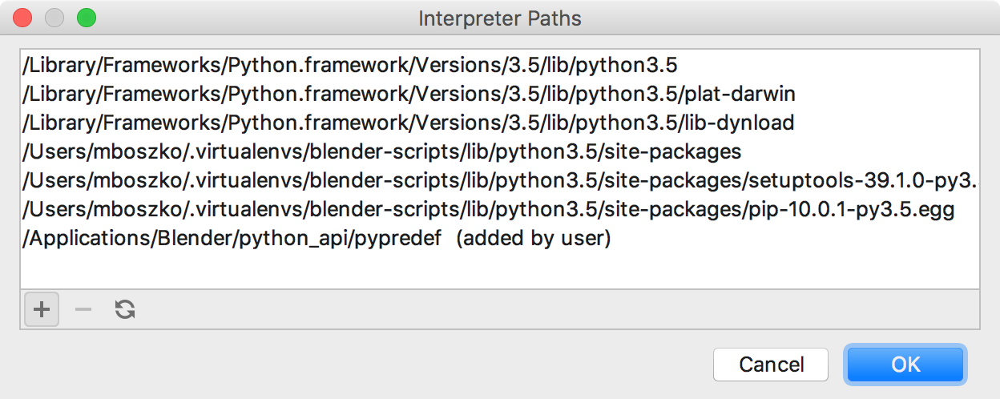

# PyCharm Blender Mac

This project includes a script that uses reflection to extract [Blender's Python API](https://docs.blender.org/api/blender_python_api_2_77_0/info_overview.html) from a running instance of [Blender](https://www.blender.org/) and store it in `.py` files usable by the [PyCharm IDE](https://www.jetbrains.com/pycharm/
) to aid in code completion.

This source code is originally derived from [pydev-blender.zip](http://airplanes3d.net/downloads/pydev/pydev-blender.zip) for the book [Programming Add-ons for Blender 2.5](http://airplanes3d.net/pydev-000_e.xml) by Witold Jaworski, and forked from the Windows-centric [pycharm-blender](https://github.com/mutantbob/pycharm-blender) by [mutantbob](https://github.com/mutantbob).

## Versions

This document assumes these software versions, as these were current when this repo was built and tested. Earlier or later versions may not work the same way.

- Blender 2.79b
- PyCharm 2018.2
- Python 3.5.3
- macOS 10.13.6

## Set up PyCharm for Blender on macOS

### Match the Python version

Blender 2.79b has Python 3.5.3 embedded, so [download Python 3.5.3 and install](https://www.python.org/downloads/release/python-353/). Python installers should keep all of the 3.x releases separate, so you should be able to install it without disrupting, say, a 3.6 or 3.7 installation.

In PyCharm 2018.2:

- PyCharm > Preferences > Project: [project-name] > Project Interpreter
- On the Project Interpreter line with the pop-up menu, click on the gear and select Add…



- Virtualenv > New Environment > select your Python 3.5 location as the Base Interpreter.



Now your project should use the same Python as is embedded in Blender.

### Auto-completion

For auto-completion, you'll need to have the definitions in the environment path.

- Download this repository ([pycharm-blender-mac](https://github.com/bobtiki/pycharm-blender-mac)) from GitHub and move `refresh_python_api` and the `python_api/` folder to the root of your Blender folder.
- Run `refresh_python_api` either from double-clicking in the Finder, or in the terminal, run:

```
# From the /Applications/Blender directory
# or wherever blender.app is installed

$ ./refresh_python_api
```

This will create Python predefinition files for the Blender Python API in the folder `/Applications/Blender/python_api/pypredef`. Now we'll need to add this path to PyCharm so it will know to look there for the definitions.

- Open the menu PyCharm > Preferences > Project: [project-name] > Project Interpreter
- On the Project Interpreter line with the pop-up menu, click on the gear and select Show All…



- Select the virtualenv that you're using for this project, and click the Paths button at the bottom. (It's the one that looks like a folder with two files indented underneath.)



- In the Interpreter Paths window, click the `+` button to add a new path, and select the `/Applications/Blender/python_api/pypredef` folder.



- Click `OK` a bunch of times to get out of Preferences.
- It may take a minute to process the new definitions. If so, you'll see a small progress bar in the bottom status bar of your PyCharm window.

Now PyCharm should be able to autocomplete Classes and methods for the Blender Python API.
